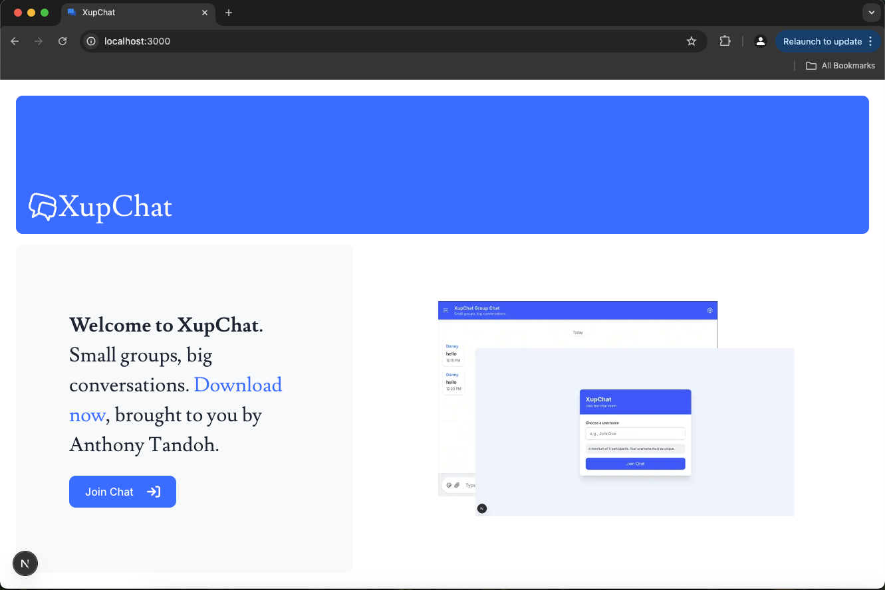

# XupChat

XupChat is a real-time chat application designed with a modern tech stack to deliver a seamless and responsive messaging experience. The frontend is built using Next.js with the App Router architecture and styled with Tailwind CSS, while the backend leverages Node.js,Express.js and MongoDB for robust data handling.

## Screenshot



## Features

- **Modern Architecture**: Built with Next.js App Router for optimized performance.
- **Responsive Design**: Fully responsive UI powered by Tailwind CSS.
- **Real-Time Messaging**: Messages update automatically every 5 seconds.
- **Timestamps**: Messages include precise timestamps for better context.
- **Custom Scrollbar**: Clean and modern UI with a custom scrollbar for better aesthetics.
- **Scalable Backend**: Built with Express.js and MongoDB for scalability and reliability.

## Usage

1. Click on Join Chat button on the homepage to navigate to the auth page.
2. Enter a username to join the chat.
3. Start sending messages.
4. Messages from all users will appear in the chat window.
5. The chat automatically updates every 5 seconds.

### Prerequisites

Ensure you have the following installed:

- **Node.js** (v14 or later)
- **MongoDB** (local or cloud instance)
- **Package Manager**: pnpm, npm, or yarn
- **Text Editor**: Visual Studio Code or any preferred editor

## Setup Instructions

### Backend Setup

1. Navigate to the backend directory:

   ```bash
   cd backend
   ```

2. Install dependencies:

   ```bash
   npm install
   ```

3. Start the server:
   ```bash
   npm run dev
   ```

### Frontend Setup

1. Navigate to the frontend directory:

   ```bash
   cd frontend
   ```

2. Install dependencies:

   ```bash
   npm install
   ```

3. Start the development server:

   ```bash
   npm run dev
   ```

4. Open your browser to [http://localhost:3000](http://localhost:3000)


## Technologies Used

- **Frontend** : React.js, Next.js with App Router and Typescript, Tailwind CSS, shadcn/ui, React Icons, date-fns,SWR, axiom, Jest

- **Backend** : Express.js, MongoDB, Mongoose, Jest

- **API** : Postman

## Links

**API**: [API DOCUMENTATION](https://documenter.getpostman.com/view/43379245/2sB2cPiQEU)

**FRONTEND**: [FRONTEND URL](https://chat-group-frontend-eta.vercel.app/)

## TODO

- [ ] Deploy Backend
- [ ] Sidebar with various components

## Author

**Name**: Tandoh Anthony Nwi-Ackah
**GitHub**: [GitHub Repository](https://github.com/TandohAnthonyNwiAckah)

## Issues and Reporting

If you encounter any issues please feel free to report them:

[GitHub Issues](https://github.com/TandohAnthonyNwiAckah/mern-project/issues)